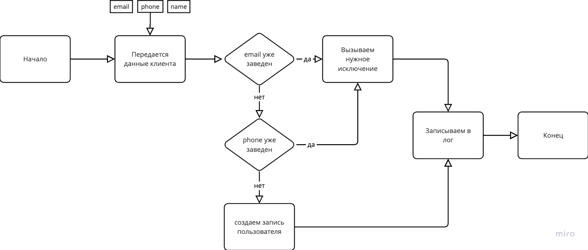
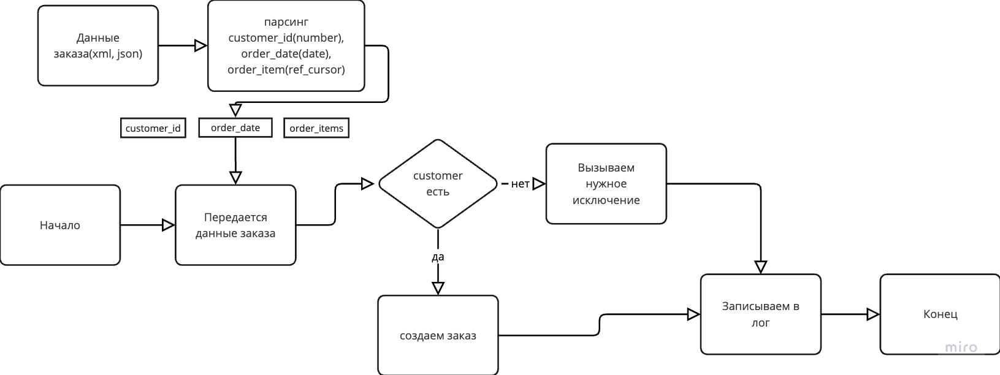

# shop_db

### Версия Oracle - Oracle Database 19c EE Extreme Perf Release 19.0.0.0.0 - Production
Version 19.17.0.0.0

Цель данного репозитория - создать фунциональные составляющие магазина на языке - PL/SQL. По инструкции ниже:

## Создайте следующие таблицы:
	•	Customers (Клиенты):
	•	Customer_ID (NUMBER) - первичный ключ
	•	Name (VARCHAR2(100))
	•	Email (VARCHAR2(100))
	•	Phone (VARCHAR2(20))
	•	Created_At (DATE)
 
	•	Orders (Заказы):
	•	Order_ID (NUMBER) - первичный ключ
	•	Customer_ID (NUMBER) - внешний ключ, ссылающийся на Customers.Customer_ID
	•	Order_Date (DATE)
	•	Total_Amount (NUMBER)
 
	•	Order_Items (Товары в заказе):
	•	Order_Item_ID (NUMBER) - первичный ключ
	•	Order_ID (NUMBER) - внешний ключ, ссылающийся на Orders.Order_ID
	•	Product_Name (VARCHAR2(100))
	•	Quantity (NUMBER)
	•	Price (NUMBER)
 

## Логика обработчика ошибок и логгера 


## create_customer
создание клиента идет по следующему флоу в пакете order_mangement.create_customer


## create_order_from_xml
нужно создать заказ с формата xml
```
<?xml version="1.0" encoding="UTF-8"?>
<Order>
    <Customer_ID>1</Customer_ID>
    <Order_Date>2024-07-02</Order_Date>
    <Items>
        <Item>
            <Product_Name>Product 1</Product_Name>
            <Quantity>2</Quantity>
            <Price>10.00</Price>
        </Item>
        <Item>
            <Product_Name>Product 2</Product_Name>
            <Quantity>1</Quantity>
            <Price>20.00</Price>
        </Item>
    </Items>
</Order>```


