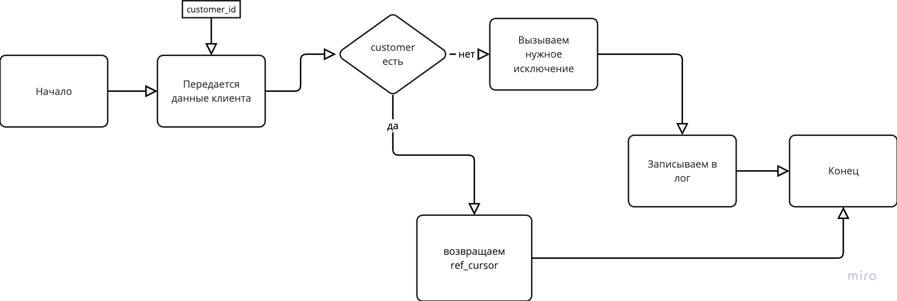

# shop_db

### Версия Oracle - Oracle Database 19c EE Extreme Perf Release 19.0.0.0.0 - Production
Version 19.17.0.0.0

Цель данного репозитория - создать фунциональные составляющие магазина на языке - PL/SQL. По инструкции ниже:

## Создайте следующие таблицы:
	•	Customers (Клиенты):
	•	Customer_ID (NUMBER) - первичный ключ
	•	Name (VARCHAR2(100))
	•	Email (VARCHAR2(100))
	•	Phone (VARCHAR2(20))
	•	Created_At (DATE)
 
	•	Orders (Заказы):
	•	Order_ID (NUMBER) - первичный ключ
	•	Customer_ID (NUMBER) - внешний ключ, ссылающийся на Customers.Customer_ID
	•	Order_Date (DATE)
	•	Total_Amount (NUMBER)
 
	•	Order_Items (Товары в заказе):
	•	Order_Item_ID (NUMBER) - первичный ключ
	•	Order_ID (NUMBER) - внешний ключ, ссылающийся на Orders.Order_ID
	•	Product_Name (VARCHAR2(100))
	•	Quantity (NUMBER)
	•	Price (NUMBER)
 

## Логика обработчика ошибок и логгера 


## create_customer
создание клиента идет по следующему флоу в пакете order_mangement.create_customer


## create_order_from_xml
нужно создать заказ с формата xml
```
<?xml version="1.0" encoding="UTF-8"?>
<Order>
    <Customer_ID>1</Customer_ID>
    <Order_Date>2024-07-02</Order_Date>
    <Items>
        <Item>
            <Product_Name>Product 1</Product_Name>
            <Quantity>2</Quantity>
            <Price>10.00</Price>
        </Item>
        <Item>
            <Product_Name>Product 2</Product_Name>
            <Quantity>1</Quantity>
            <Price>20.00</Price>
        </Item>
    </Items>
</Order>
```


## get_customer_orders

Оставил таким образом, что он будет возвращать курсор и создал пример функции get_customer_orders_xml, чтобы показать как его можно будет в дальнейшем переиспользовать

## update_order_total

работает как закоменченный блок апдейт. с триггером тоже можно сделать, но если будет триггер нужно будет убрать вызов процедуры. order_management.create_order

```
    update_order_total(v_order_id);
```

## sync_order_with_api
для логирования ответа сгенерил такие ответы, и будем представлять, что сервер будет так отвечать)

```
{
    "status": "success",
    "message": "Order has been successfully created.",
    "order_id": 123,
    "customer_id": 1,
    "order_date": "2024-07-02",
    "total_amount": 30.00
}

{
    "status": "error",
    "message": "Validation failed for the provided order data.",
    "errors": [
        {
            "field": "items",
            "message": "Product names cannot be empty."
        },
        {
            "field": "quantity",
            "message": "Quantity must be greater than zero."
        }
    ]
}

{
    "status": "error",
    "message": "Customer with the given ID does not exist.",
    "customer_id": 1
}

{
    "status": "error",
    "message": "An unexpected error occurred while processing the order.",
    "error_details": "Database connection timeout"
}

{
    "status": "error",
    "message": "An order with the same ID already exists.",
    "order_id": 123
}

{
    "status": "error",
    "message": "The request is missing required fields.",
    "missing_fields": [
        "order_date",
        "total_amount"
    ]
}

```


